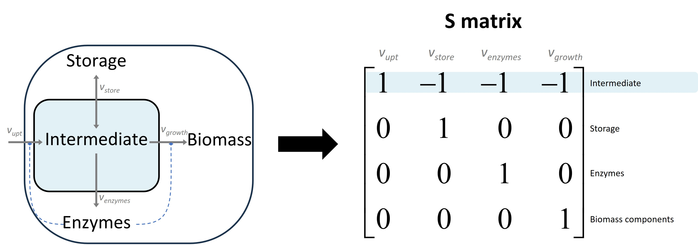

MinCell 1 with quotas
+++++++++++++++++++++

The code for this example is available in our main GitHub repository.
https://github.com/TP-Watson/py_cFBA

We start with a simple toy model of a minimal cell. This is the same 
example that is presented in our article [1]. A schematic of the model 
with its corresponding S matrix can be seen in the following scheme:

_____________________

In this tutorial we will continue with the simulations from 
:doc:`MinCell 1</Examples/MinCell 1>`, in which the growth of the system 
was optimized (reaching a max growth of 1.8). However, in this example we
will implement quota components. 

Simulation with different quotas
^^^^^^^^^^^^^^^^^^^^^^^^^^^^^^^^

As explained in :doc:`Method Constraints</Method/Constraints>`, in cFBA you 
can define **quotas** which are specific constraints to each imbalanced 
metabolite at a speific time point. These quotas can be classified as:

- Maximum quota: inequality constraint for which an imbalanced metabolite exceed. ``max``.
- Minimum quota: inequality constraint for which an imbalanced metabolite must be at least. ``min``.
- Equality quota: exact constraint for the concentration of an imbalanced metabolite. ``equality``.

In the previous example we did not define quotas, so the variable *quotas* 
was an empty list. In this example, we will define several different quotas
for imbalanced metabolites. The definition of these quotas is done as follows:

.. code-block:: python

   # Quotas for the model
   quotas = [
   #   ['type',     'metabolite', time, value]
       ['equality', 'Storage',    0,    0.5],
       ['max',      'Biomass',    2,    1],
       ['equality', 'Enzymes',    0,    0.5]
   ]

These definitions indicate that:

- At time point 0, *Storage* should be *exactly* 0.5 mol/gDW.
- At time point 2, *Biomass* should be *at least* 1 mol/gDW.
- At time point 0, *Enzymes* should be *at least* 0.5 mol/gDW.

We then perform the optimization as done in the preious example.

.. code-block:: python

   # Find the optimal alpha value
   print('Time simulation:')
   alpha, prob = find_alpha(cons, Mk, imbalanced_mets)
   print('Growth of the system: {:.2f}'.format(alpha))  # Print the optimal alpha value

   # Retrieve the solution: fluxes, amounts, and time points
   fluxes, amounts, t = get_fluxes_amounts(sbml_file, prob, dt)

The resulting growth of the system is lowered, since we forced
the model to start with higher storage concentrations. In the 
first example, the optimal solution was that in which storage 
started with a concentration of 0 mol/gDW at the begining. 

.. code-block::

   Time simulation:
   0.02 min
   Growth of the system: 1.50

Now we can plot the profiles of the metabolites.

.. code-block:: python

   # Plot the metabolite changes over time
   colors = ['#a6cee3', '#1f78b4', '#b2df8a']  # Colors for plotting

   plt.figure(figsize=[5, 3])
   plt.subplot(1, 2, 1)
   plot_met('Storage', colors[0])  # Plot 'Storage' metabolite levels
   plot_met('Biomass', colors[2])  # Plot 'Biomass' metabolite levels
   plt.ylim([-0.1, 2.7])  # Set y-axis limits

   plt.subplot(1, 2, 2)
   plot_met('Enzymes', colors[1])  # Plot 'Enzymes' metabolite levels
   plt.ylim([-0.1, 2.7])  # Set y-axis limits
   plt.ylabel(None)  # Remove y-axis label

   plt.savefig('MinCell_01_3.jpeg', bbox_inches = 'tight', dpi = 300)
   plt.show()  # Show the plots

And the corresponding fluxes.

.. code-block:: python

   # Plot the flux changes over time
   colors = ['#e41a1c', '#377eb8', '#4daf4a', '#984ea3']  # Colors for plotting

   plt.figure(figsize=[5, 3])
   plot_flux('vstorage', colors[0])  # Plot 'vstorage' flux
   plot_flux('venzymes', colors[1])  # Plot 'venzymes' flux
   plot_flux('vgrowth', colors[2])  # Plot 'vgrowth' flux
   plot_flux('vupt', colors[3])  # Plot 'vupt' flux

   plt.savefig('MinCell_01_4.jpeg', bbox_inches = 'tight', dpi = 300)
   plt.show()  # Show the plots

___________________________

With this, you have finalized the tutorial on MinCell 1. You can 
move onto the next examples in which:

- In :doc:`MinCell 2</Examples/MinCell 2>` we include a cost asociated to storage cycling.
- In :doc:`MinCell 3</Examples/MinCell 3>` we include three different enzymes as catalysts.
- In :doc:`MinCell 4</Examples/MinCell 4>` we include a temporal limit on enzyme synthesis.
