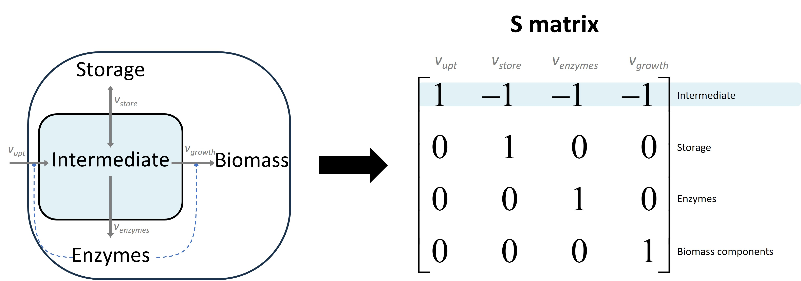
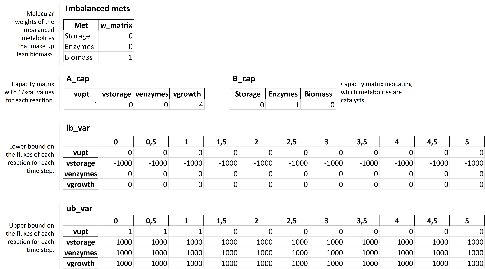
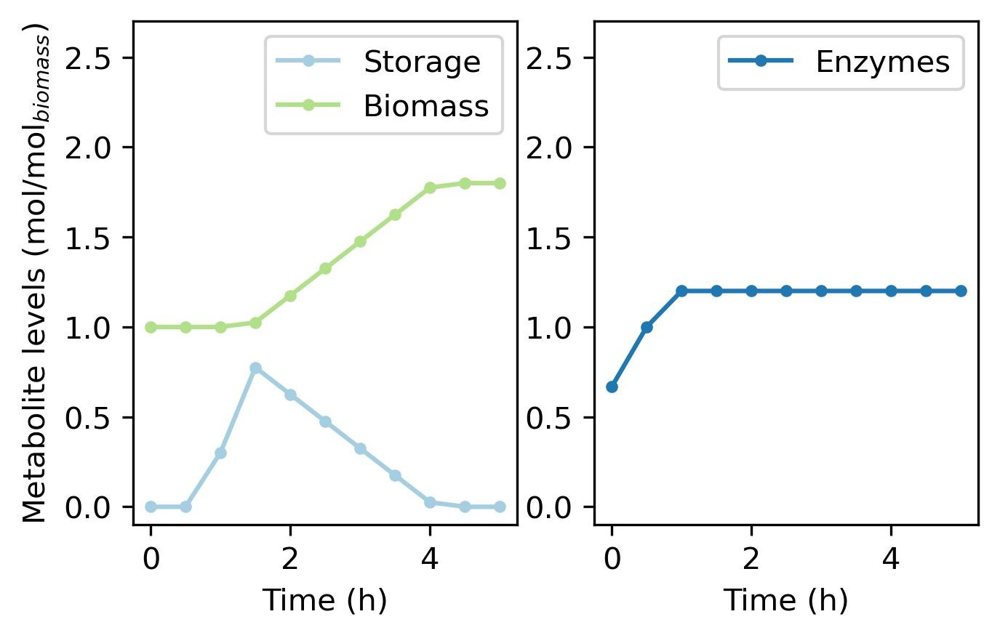
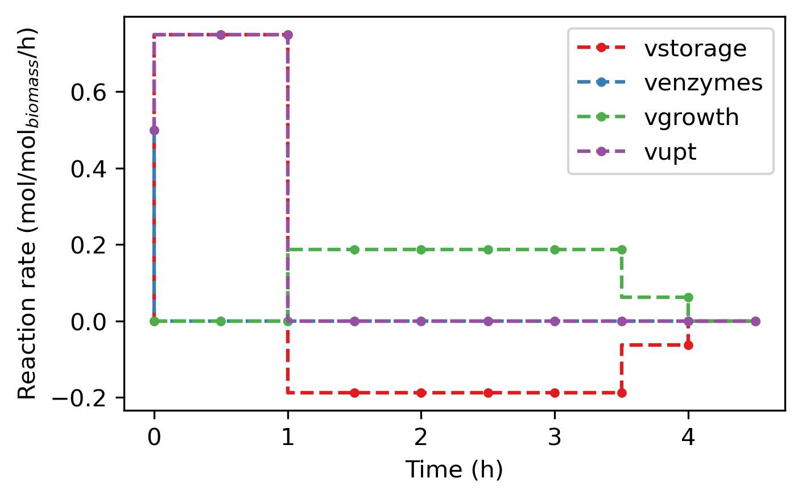

MinCell 1
+++++++++

The code for this example is available in our main GitHub repository.
We start with a simple toy model of a minimal cell. This is the same 
example that is presented in our article [1]. A schematic of the model 
with its corresponding S matrix can be seen in the following scheme:

_____________________

In this tutorial we will simulate the minimal cell with increasing 
degrees of model complexity. You can follow this step-by-step 
implementation with the provided codes available at our GitHub. In all 
the examples below, uptake of substrate is only possible during the 
first 3 timepoints of the simulation. 

We will perform the following simulations:

1. Current page: **MinCell with one enzyme catalyzing the network reactions.** 
2. :doc:`MinCell 2</Examples/MinCell 2>` including a cost asociated to storage cycling.
3. :doc:`MinCell 3</Examples/MinCell 3>` with *three enzymes* catalyzing individual reactions of the network.
4. :doc:`MinCell 4</Examples/MinCell 4>` from (3) allowing enzyme synthesis late in cyle. 

Now, we will take you through each step in the step-by-step guide:

Import py_cFBA and install dependencies
^^^^^^^^^^^^^^^^^^^^^^^^^^^^^^^^^^^^^^^
Let's first import ``py_cFBA`` as well as other required libraries:

.. code-block:: python

   from py_cFBA import *
   import numpy as np
   import pandas as pd
   import matplotlib.pyplot as plt

Remember that py_cFBA makes use of other libraries such as ``python-libsbml`` 
and ``optlang`` which need to be installed previously.

In this example we will also define two functions to help us plot our
results from the simulations. 

.. code-block:: python

   # Function to plot metabolite profiles
   # Args:
   # - metabolite: name of the metabolite to plot
   # - color_met: color of the plot line
   def plot_met(metabolite, color_met):
       for i, met in enumerate(imbalanced_mets):
           if met == metabolite:
               plt.plot(t, amounts[i, :], '.-', color=color_met, label=met)
               plt.legend()
               plt.xlabel('Time')
               plt.ylabel('Metabolite levels (mol/mol$_{biomass}$)')

   # Function to plot flux profiles
   # Args:
   # - flux: name of the flux (reaction) to plot
   # - color_flx: color of the plot line
   def plot_flux(flux, color_flx):
       for i, rxn in enumerate(rxns):
           if rxn == flux:
               plt.step(t[:-1], fluxes[i, :], '.--', color=color_flx, label=flux)
               plt.legend()
               plt.xlabel('Time')
               plt.ylabel('Reaction rate (mol/mol$_{biomass}$/h)')

1. Generate an excel backbone
^^^^^^^^^^^^^^^^^^^^^^^^^^^^^^^

We initially start this example with a DataFrame containing the 
Stoichiometric matrix. This matrix should define the reactions as 
columns and the metabolites as rows. In this example, the matrix is 
read from an excel sheet named 'Model S matrices.xlsx'.

.. code-block:: python
    
   S_mat = pd.read_excel('Models S matrices.xlsx',sheet_name='Basic model',index_col=0, header = 0)
   
   # Create model backbone for cFBA 
   data = cFBA_backbone_from_S_matrix(S_mat)
   generate_cFBA_excel_sheet(S_mat, data, 'MinCell_01.xlsx')

When running the function ``cFBA_backbone_from_S_matrix``, the user can input 
certain parameters unique to the model to be simulated. The inputs for this 
specific model are:

- **Imbalanced metabolites**: Storage, Enzymes and Biomass.
- **Simulation time**: Total 5 (hours) with dt = 0.5.
- **Enzyme capacities?**: Yes.
- **Which imb mets are catalysts**: Enzymes.

2. Popullate the excel file with model specifics
^^^^^^^^^^^^^^^^^^^^^^^^^^^^^^^^^^^^^^^^^^^^^^^^

An excel sheet (named *'MinCell_01.xlsx'*) was created. Now you need to 
include model specifics in this sheet, following the basics of the 
:doc:`Method Constraints</Method/Constraints>`. You can follow these steps:

- Include molecular weights for imbalanced metabolites (tab: Imbalanced_mets) that will take part of lean biomass.
- Change the time-dependent lower bounds for vstorage so it can be reversible (e.g. with -1000 for all time points).
- Change the time-dependent upper bounds for vupt such that only 1 mol/h can be uptaken till time point 3 (tab: ub_var).
- Include 1/kcat values to the A_cap matrix to denote reactions catalyzed by enzymes (tab: A_cap). Note that B_cap already indicates that the first row is of the met: enzymes.  

Summary of the changes made:

.. note::
    These changes are already included in the files provided on our GitHub. For this reason, step 2 is commented out in the provided code. 

3. Generate an SBML file from excel
^^^^^^^^^^^^^^^^^^^^^^^^^^^^^^^^^^^

Using the same file names from the previous steps:

.. code-block:: python

   # Create SBML file for the model
   excel_file = 'MinCell_01.xlsx'        # Input Excel file
   output_file = 'MinCell SBMLA_01.xml'  # Output SBML file
   excel_to_sbml(excel_file, output_file)

4. Perform optimization (no quotas)
^^^^^^^^^^^^^^^^^^^^^^^^^^^^^^^^^^^
Initially we will not set quotas. In the following, we use the 
SBML file generated in step 3 to generate the model components. 

.. code-block:: python

   # Load the SBML file and set up the cFBA model
   sbml_file = "MinCell SBMLA_01.xml"  # SBML file for the model
   quotas = []  # List of quotas (none in this case)
   # Generate the Linear Programming (LP) model components for cFBA
   cons, Mk, imbalanced_mets, nm, nr, nt = generate_LP_cFBA(sbml_file, quotas, dt)

Next, we test that the model works with a µ value (also referred 
to as alpha value) of 1. That means, if there is a solution to 
the current model with no growth. If this is not possible, then 
the optimization cannot work meaning that the model is over-
constrained. 

.. code-block:: python

   # Test optimization with a specific alpha value
   alpha_test = 1
   prob = create_lp_problem(alpha_test, [*cons], Mk, imbalanced_mets)  # Create LP problem
   status = prob.optimize()  # Optimize the problem
   print('Test on model with no growth:', status)  # Print the optimization status

Next, we can perform the cFBA optimization using the binary search
specified in :doc:`Optimization</Method/Optimization >`. 

.. code-block:: python

   # Find the optimal alpha value
   print('Time simulation:')
   alpha, prob = find_alpha(cons, Mk, imbalanced_mets)
   print('Growth of the system: {:.2f}'.format(alpha))  # Print the optimal alpha value

The function find_alpha prints the time it takes to compute the
search. the current code should give the following output:

.. code-block::

   Time simulation:
   0.03 min
   Growth of the system: 1.80

Finally, the amounts and fluxes from the simulations can be 
retrieved and plotted. Using our custom made functions in our 
first step, we look at the imbalanced metabolites over time:

.. code-block:: python

   # Retrieve the solution (fluxes, amounts, and time points)
   fluxes, amounts, t = get_fluxes_amounts(sbml_file, prob, dt)

   # Plot the metabolite changes over time
   colors = ['#a6cee3', '#1f78b4', '#b2df8a']  # Colors for plotting

   plt.figure(figsize=[5, 3])
   plt.subplot(1, 2, 1)
   plot_met('Storage', colors[0])  # Plot 'Storage' metabolite levels
   plot_met('Biomass', colors[2])  # Plot 'Biomass' metabolite levels
   plt.ylim([-0.1, 2.7])  # Set y-axis limits

   plt.subplot(1, 2, 2)
   plot_met('Enzymes', colors[1])  # Plot 'Enzymes' metabolite levels
   plt.ylim([-0.1, 2.7])  # Set y-axis limits
   plt.ylabel(None)  # Remove y-axis label

   plt.show()  # Show the plots

Similarly we can analyse the fluxes that lead to the optimal solution 
in the simulation. 

.. note::
    Fluxes are represented using 'plt.astep', since each given flux is active during each individual **time-step** and not each **time-point** as the imbalanced metabolites. 

.. code-block:: python

   # Plot the flux changes over time
   colors = ['#e41a1c', '#377eb8', '#4daf4a', '#984ea3']  # Colors for plotting

   plt.figure(figsize=[5, 3])
   plot_flux('vstorage', colors[0])  # Plot 'vstorage' flux
   plot_flux('venzymes', colors[1])  # Plot 'venzymes' flux
   plot_flux('vgrowth', colors[2])  # Plot 'vgrowth' flux
   plot_flux('vupt', colors[3])  # Plot 'vupt' flux

   plt.show()  # Show the plots

___________________________

With this, you have finalized the tutorial on MinCell 1. You can 
move onto the next examples in which:

- In :doc:`MinCell 1 quotas</Examples/MinCell 1 with quotas>` we include quotas to this example.
- In :doc:`MinCell 2</Examples/MinCell 2>` we include a cost asociated to storage cycling.
- In :doc:`MinCell 3</Examples/MinCell 3>` we include three different enzymes as catalysts.
- In :doc:`MinCell 4</Examples/MinCell 4>` we include a temporal limit on enzyme synthesis.
