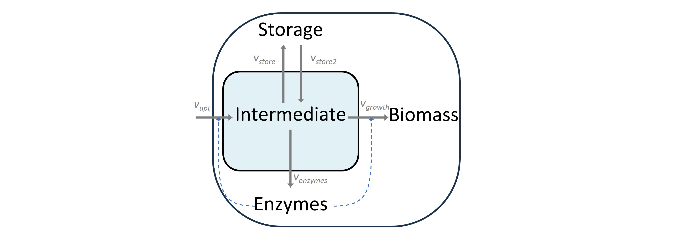
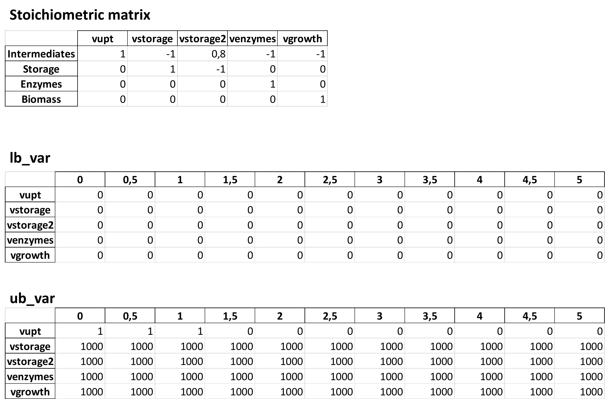

MinCell 2
+++++++++

The code for this example is available in our main GitHub repository.
https://github.com/TP-Watson/py_cFBA

We continue with the simple toy model of a minimal cell. This is the same 
example that is presented in our article [1]. A schematic of the model 
with its corresponding S matrix can be seen in the following scheme:

_____________________

In this example we will simulate the minimal cell including a **cost** 
asociated to the cycling of the *Storage* metabolite. Simply put, the 'S' 
matrix is modified to include a loss of *Intermediate* in the degradation
of *Storage*. We will follow the same steps as in MinCell 1. 

You can follow this step-by-step implementation with the provided codes 
available at our GitHub. In all the examples below, uptake of substrate is 
only possible during the first 3 timepoints of the simulation. 

Now, we will take you through each step in the step-by-step guide:

Change the stroichiometry of the model
^^^^^^^^^^^^^^^^^^^^^^^^^^^^^^^^^^^^^^

First of all, the model stoichiometry needs to be modified to include the 
cost of storage cycling. Simply put, the reactions of the model will be:

- Storage synthesis: **- 1** *Intermediate* **+ 1** *Storage*
- Storage degradation: **- 1** *Storage* **+ 0.8** *Intermediate*

Since the model is very similar to that in :doc:`MinCell 1</Examples/MinCell 1>`,
we will only highlight the steps that are different. 

Generate and popullate the excel sheet
^^^^^^^^^^^^^^^^^^^^^^^^^^^^^^^^^^^^^^^

The stoichiometric matrix was modified in excel and can be read from an excel 
sheet named 'Model S matrices.xlsx', sheet name 'Basic model 2'. 

.. code-block:: python
    
   S_mat = pd.read_excel('Models S matrices.xlsx',sheet_name='Basic model 2',index_col=0, header = 0)
   
   # Create model backbone for cFBA 
   data = cFBA_backbone_from_S_matrix(S_mat)
   generate_cFBA_excel_sheet(S_mat, data, 'MinCell_02.xlsx')

The input for this functions are the same as in MinCell1. Further, the excel sheet 
can be filled out with the specifics of the model. The only difference with the 
previous model lies in the lower bounds. Since this model includes a reaction for 
the syntehsis and degradation of storage, then both reactions are irreversible.

.. note::
    These changes are already included in the files provided on our GitHub. For this reason, the code is initially commented out.

Generate SBML file and perform simulations
^^^^^^^^^^^^^^^^^^^^^^^^^^^^^^^^^^^^^^^^^^

Next we generate the SBML file.

.. code-block:: python

   # Create SBML file for the model
   excel_file = 'MinCell_02.xlsx'        # Input Excel file
   output_file = 'MinCell SBMLA_02.xml'  # Output SBML file
   excel_to_sbml(excel_file, output_file)

Then the SBML file generated is used to perform optimization.

.. code-block:: python

   # Load the SBML file and set up the cFBA model
   sbml_file = "MinCell SBMLA_02.xml"  # SBML file for the model
   quotas = []  # List of quotas (none in this case)
   # Generate the Linear Programming (LP) model components for cFBA
   cons, Mk, imbalanced_mets, nm, nr, nt = generate_LP_cFBA(sbml_file, quotas, dt)

   # Find the optimal alpha value
   print('Time simulation:')
   alpha, prob = find_alpha(cons, Mk, imbalanced_mets)
   print('Growth of the system: {:.2f}'.format(alpha))  # Print the optimal alpha value

The function find_alpha prints the time it takes to compute the
search. the current code should give the following output:

.. code-block::

   Time simulation:
   0.04 min
   Growth of the system: 1.70

You can plot the metabolites and fluxes just as we did in MinCell 1. You could try out 
what the effect of more expensive storage cycling is to the model. At some point, storage
becomes so expensive, that the model will stagnate at a given growth without using 
storage.

___________________________

With this, you have finalized the tutorial on MinCell 2. You can 
move onto the next examples in which:

- In :doc:`MinCell 3</Examples/MinCell 3>` we include three different enzymes as catalysts.
- In :doc:`MinCell 4</Examples/MinCell 4>` we include a temporal limit on enzyme synthesis.
