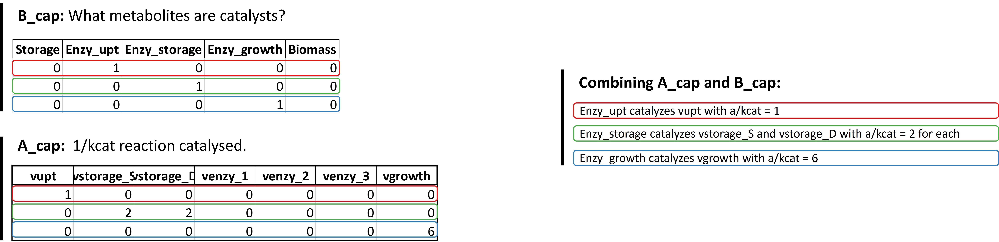

MinCell 3
+++++++++

The code for this example is available in our main GitHub repository.
https://github.com/TP-Watson/py_cFBA

We continue with the simple toy model of a minimal cell, with some 
modifications. In this case, three separate enzymes will be considered,
each catalysing a different reaction. A schematic of the model indicating 
the catalyst action is presented below:

_____________________

In this example we will simulate the minimal cell including three enzymes that
individually catalyse different reactions. This modification needs to be included 
in the 'S' matrix and in the capacities matirx. Below we will guide you step-by-step
on how to perform such simulations. 

You can follow this step-by-step implementation with the provided codes 
available at our GitHub. In all the examples below, uptake of substrate is 
only possible during the first 3 timepoints of the simulation. 

Now, we will take you through each step in the step-by-step guide:

1. Generate an excel backbone
^^^^^^^^^^^^^^^^^^^^^^^^^^^^^^^
In this example, the matrix is read from an excel sheet named 'Model S matrices.xlsx',
in the sheet named 'Basic_model_3'. The stoichiometric matrix is indicated below:

.. image:: MinCell3_2.jpg

.. code-block:: python
    
   # Read the S matrix from an Excel sheet
   S_mat = pd.read_excel('Models S matrices.xlsx', sheet_name='Basic model_3', index_col=0, header=0)
   imbalanced_mets = list(S_mat.index)  # List of imbalanced metabolites
   rxns = list(S_mat.columns)  # List of reactions

   # Create model backbone for cFBA 
   # (data, dt) = cFBA_backbone_from_S_matrix(S_mat)
   # generate_cFBA_excel_sheet(S_mat, data, 'MinCell_03.xlsx')

The parameters required for the function ``cFBA_backbone_from_S_matrix`` are similar
to those used in the example :doc:`MinCell 1</Examples/MinCell 1>`. The parameters are:
 
- **Imbalanced metabolites**: Storage, Enzy_upt, Enzy_storage, Enzy_growth, Biomass
- **Simulation time**: Total 5 (hours) with dt = 0.5.
- **Enzyme capacities?**: Yes.
- **Which imb mets are catalysts**: Enzy_upt, Enzy_storage, Enzy_growth.

2. Popullate the excel file with model specifics
^^^^^^^^^^^^^^^^^^^^^^^^^^^^^^^^^^^^^^^^^^^^^^^^

An excel sheet (named *'MinCell_03.xlsx'*) was created. Now you need to 
include model specifics in this sheet, following the basics of the 
:doc:`Method Constraints</Method/Constraints>`. You can follow these steps:

- Include molecular weights for imbalanced metabolites (tab: Imbalanced_mets) that will take part of lean biomass.
- Change the time-dependent upper bounds for vupt such that only 1 mol/h can be uptaken till time point 3 (tab: ub_var).
- Include 1/kcat values to the A_cap matrix to denote reactions catalyzed by enzymes (tab: A_cap). Note that B_cap is automatically created after step 1. Each row indicates which metablite acts as a catalyst.

**Summary of the A_cap and B_cap matrices**

The B_cap matrix is automatically created. It indicates in each row, which 
imbalanced metabolite will act as a catalyst for a (or several) reaction(s). 
Then, the A_cap matrix needs to be filled. Each row in A_cap will match to 
the row in B_cap, thus only the reactions catalysed by that metabolite need 
to be filled. A_cap is filled with 1/kcat values (in hours). 

.. note::
    These changes are already included in the files provided on our GitHub. For this reason, step 2 is commented out in the provided code. 

3. Generate an SBML file from excel
^^^^^^^^^^^^^^^^^^^^^^^^^^^^^^^^^^^

Using the same file names from the previous steps:

.. code-block:: python

   # Create SBML file for the model
   excel_file = 'MinCell_03.xlsx'  # Input Excel file
   output_file = 'MinCell SBMLA_03.xml'  # Output SBML file
   excel_to_sbml(excel_file, output_file)  # Convert Excel to SBML

4. Perform optimization (no quotas)
^^^^^^^^^^^^^^^^^^^^^^^^^^^^^^^^^^^
For this example we will not include quotas. In the following, we use 
the SBML file generated in step 3 to generate the model components and 
perform the optimization.

.. code-block:: python

   # Load the SBML file and set up the cFBA model
   sbml_file = "MinCell SBMLA_03.xml"  # SBML file for the model
   quotas = []  # List of quotas (none in this case)
   # Generate the Linear Programming (LP) model components for cFBA
   cons, Mk, imbalanced_mets, nm, nr, nt = generate_LP_cFBA(sbml_file, quotas, dt)

   # Test optimization with a specific alpha value
   alpha_test = 1
   prob = create_lp_problem(alpha_test, [*cons], Mk, imbalanced_mets)  # Create LP problem
   status = prob.optimize()  # Optimize the problem
   print('Test on model with no growth:', status)  # Print the optimization status

   # Find the optimal alpha value
   print('Time simulation:')
   alpha, prob = find_alpha(cons, Mk, imbalanced_mets)
   print('Growth of the system: {:.2f}'.format(alpha))  # Print the optimal alpha value

   # Retrieve the solution (fluxes, amounts, and time points)
   fluxes, amounts, t = get_fluxes_amounts(sbml_file, prob, dt)

The function find_alpha prints the time it takes to compute the
search. the current code should give the following output:

.. code-block::

   Time simulation:
   0.03 min
   Growth of the system: 1.49

Finally, the amounts and fluxes from the simulations can be 
retrieved and plotted. Using our custom made functions from MinCell 1,
we look at the imbalanced metabolites over time:

.. code-block:: python

   # Plot the metabolite changes over time
   colors = ['#a6cee3', '#1f78b4', '#b2df8a']  # Colors for plotting

   plt.figure(figsize=[5, 3])
   plt.subplot(1, 2, 1)
   plot_met('Storage', colors[0])  # Plot 'Storage' metabolite levels
   plot_met('Biomass', colors[2])  # Plot 'Biomass' metabolite levels
   plt.ylim([-0.1, 2.7])  # Set y-axis limits

   plt.subplot(1, 2, 2)
   colors = ['#e41a1c', '#377eb8', '#4daf4a', '#984ea3']  # Colors for plotting
   plot_met('Enzy_upt', colors[0])  # Plot 'Enzymes' metabolite levels
   plot_met('Enzy_storage', colors[2])  # Plot 'Enzymes' metabolite levels
   plot_met('Enzy_growth', colors[1])  # Plot 'Enzymes' metabolite levels
   plt.ylim([-0.1, 2.7])  # Set y-axis limits
   plt.ylabel(None)  # Remove y-axis label

   plt.savefig('MinCell_03_1.jpeg', bbox_inches = 'tight', dpi = 300)
   plt.show()  # Show the plots

Similarly we can analyse the fluxes that lead to the optimal solution 
in the simulation. 

.. note::
    Fluxes are represented using 'plt.astep', since each given flux is active during each individual **time-step** and not each **time-point** as the imbalanced metabolites. 

.. code-block:: python

   # Plot the flux changes over time
   colors = ['#e41a1c', '#377eb8', '#4daf4a', '#984ea3']  # Colors for plotting

   plt.figure(figsize=[5, 3])
   plot_flux('vupt', colors[0])  # Plot 'vstorage' flux
   plot_flux('vstorage_S', colors[1])  # Plot 'venzymes' flux
   plot_flux('vstorage_D', colors[1])  # Plot 'venzymes' flux
   plot_flux('vgrowth', colors[2])  # Plot 'vgrowth' flux

   plt.savefig('MinCell_03_2.jpeg', bbox_inches = 'tight', dpi = 300)
   plt.show()  # Show the plots

___________________________

With this, you have finalized the tutorial on the minimal cell. With these
examples you should be able to implement your own cFBA system in Python following
our step-by-step guide. 

Good luck!