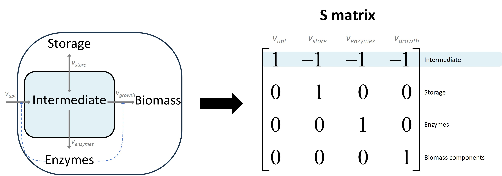
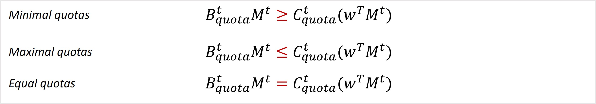

Constraints
+++++++++++++

As any other constraint-based methods, cFBA deals with equality 
and in-equality constraints. These are detailed in this section.

Stoichiometric matrix
^^^^^^^^^^^^^^^^^^^^^

The basic structure of the model requires a stoichiometric matrix 
(**S**) indicating the relationship between metabolites (in the rows) 
and reactions (in the columns). A simple example of a stoichiometric 
model is depicted in the image below for a simple model.

    
In this simple example, you can identify 4 metabolites that are 
explicitly included in the **S** matrix, connected by 4 reactions. 
Now, not all metabolites are treated in the same way in cFBA, thus 
we will make a distinction between steady state and non-steady state 
metabolites. 

Imbalanced Metabolites
^^^^^^^^^^^^^^^^^^^^^^ 

These metabolites exhibit explicit concentration changes over time. Thus, 
their concentration is tracked over time using the following expression:

In this expression the **S** matrix is subdivided into that containing 
only imbalanced metabolites. 

Imbalanced metabolites typically include catalytic biomolecules such as 
enzymes and ribosomes. Other non-catalytic elements may also include proteins,
 membranes, storage polymers and even substrates. 

*Definition of biomass*

Each simulation is normalized to an initial amount of biomass (typically 1 
gram dry weight (gDW)). Biomass is defined as the weighed sum of all components 
in M (imbalanced metabolites) at each time point. To normalize the initial time 
point of the simulation to 1 gDW, the following is employed.

As per definition, storage polymers are included in the *M* vector and thus are 
included in the normalization of starting biomass. This is possible, however one 
must note that certain organisms store excessive amounts of storage polymers 
(sometimes even accounting to 90 % of cell volume), which would leave no space for 
the rest of the cellular components. 

An alternative is to model storage polymers as an independent variable from that of
 biomass. This can be done simply by defining storage polymers as an imbalanced 
metabolite but with a weight contribution (*w*) of 0. 

Quotas
^^^^^^

Quotas are equality or inequality constraints applied to the imbalanced metabolites. 
Simply put, they help you define if a given metabolite concentration should be equal 
to (equality), larger or lower than (inequality) a defined value. 

For a practical implementation, we have split the quotas into the following categories:

1. Minimal quotas for the start of the simulation: Bquota, Cquota.
2. Equality quotas for the start of the simulation: Bquota_in, Cquota_in
3. Maximal quota for a specific time point: Bquota_max, Cquota_max, t_quota_max
4. Minimal quotas for all the simulation: Bquota_all_t, Cquota_all_t

In each case, the 'B' matrix denotes the positional matrix (similar as with the 
enzyme capacities). The 'C' matrix instead, determines the value of the quota. 
The quotas are implemented as indicated below:

Quotas are implemented in using our method in :doc:`MinCell 1 quotas</Examples/MinCell 1 with quotas>` 

Balanced Metabolites
^^^^^^^^^^^^^^^^^^^^^^

The remainder of metabolites are presumed to remain in quasi-steady state, with 
their turnover rate significantly faster than that of imbalanced metabolites. Thus, 
these metabolites are treated as typically done in `FBA`.

Cyclic behaviour
^^^^^^^^^^^^^^^^

One of the features that leads to predictions of emergent metabolic strategies with 
cFBA is the constraint for cyclicality. This is achieved with enforcing the following:

This relation enforces an identical relative amounts of imbalanced metabolites at both the beginning and end of the simulation.

_____________________