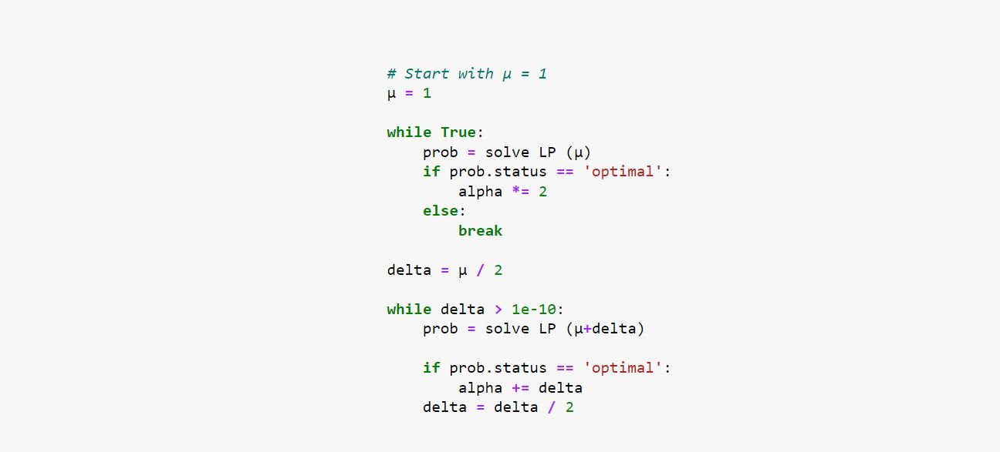

Optimization
+++++++++++++

Recall the constraint enforcing the cyclic behaviour of cFBA:

.. image:: Methods_img5.jpg

Here µ represents the balanced growth of the system. Together, the system is a quadratic programming problem which becomes linear for each value of µ. In other words, the LP problem can be solved for a given value of µ. 

Next, a binary search algorithm is applied to find the highest achievable µ (within a defined error margin). 

.. note::
    This binary search assumes that if a system can grow at a valye µ1 and at a rate µ2 > µ1; then any growth rate µc within these two values is also probable. 

The algorithm starts by attempting to solve the problem with µ = 1. Then, the following search is done: 

In this case, the algorithm will run until the 'delta' value (increment between two µ values) is lower than 1e-10. This is the defined precision of the algorithm, and can be manually modified. 

